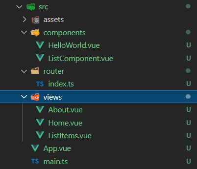

# mevn-02-vue3-template

## Contents
- [mevn-02-vue3-template](#mevn-02-vue3-template)
  - [Contents](#contents)
  - [Introduction](#introduction)
  - [installation](#installation)
  - [tidy up the app](#tidy-up-the-app)
  - [install bootstrap](#install-bootstrap)
  - [creating first component file](#creating-first-component-file)

## Introduction

This is a learning repository for learning the MEVN stack which is 

- MongoDB
- ExpressJS
- VueJS
- NodeJS

I will be following this tutorial to get started https://www.positronx.io/vue-mevn-stack-tutorial-build-full-stack-vue-js-crud-app/ which creates a basic CRUD database

## installation

*run these commands with administrator privileges on windows, sudo on linux*

if nodejs is not installed, install it from https://nodejs.org/en/

install latest versions of npm and yarn

```js
node -v
# v10.15.3
npm install -g npm@latest 
npm -v 
# 7.20.6
npm install -g yarn 
yarn -v 
# 1.22.4
yarn global add @vue/cli 
```

create our template application 

```js
vue create mevn-02
# manually choose typescript, babel, router, linter, choose vue version (3), use class style syntax, use babel, use history mode
cd mevn-02
yarn serve
```

navigate to http://localhost:8080 to run the app

now i don't like bootstrap as it is 'old hat' but in this tutorial it requests bootstrap so let's play along

## tidy up the app

we can remove the vuejs default text which is visible on the home page
- remove `assets\logo.png` file 
- remove the mention to `assets\logo.png` in `views\Home.vue`

## install bootstrap

```js
yarn add bootstrap
```

in `main.ts` add this line

```js
import { createApp } from 'vue'
import App from './App.vue'
import router from './router'
import 'bootstrap/dist/css/bootstrap.min.css'
createApp(App).use(router).mount('#app')
```
if you toggle the line with a comment so it's either installed or not, you should be able to see the difference!

## creating first component file

to create our first component file let's clone `HelloWorld.vue` in the `components` folder and rename it to `ListComponent.vue` as all components have to have capitalised names

`ListComponent.vue`

```vue
<template>
  <div class="row justify-content-center">
    <div class="col-md-6">
      <h1>{{ msg }}</h1>
    </div>
  </div>
</template>

<script lang="ts">
import { Options, Vue } from 'vue-class-component';

@Options({
  props: {
    msg: String
  }
})
export default class ListComponent extends Vue {
  msg!: string;
  data() {
    return {
      
    }
  }
}
</script>
```

to see this file we must add it to the `router\index.ts` file

```js
import { createRouter, createWebHistory, RouteRecordRaw } from 'vue-router'
import Home from '../views/Home.vue'

const routes: Array<RouteRecordRaw> = [
  {     path: '/',     name: 'Home',      component: Home   },
  {      path: '/about',     name: 'About',    component: () => import(/* webpackChunkName: "about" */ '../views/About.vue')  },
  {      path: '/list',     name: 'List',    component: () => import(/* webpackChunkName: "list" */ '../views/ListItems.vue')  },
]

const router = createRouter({
  history: createWebHistory(process.env.BASE_URL),
  routes
})

export default router
```

notice that the view referred to has not been created yet so let's create it at `views\ListItems.vue`

```js
<template>
  <div>
    <ListComponent msg="Welcome to Your Vue.js + TypeScript App"/>
  </div>
</template>

<script lang="ts">
import { Options, Vue } from 'vue-class-component';
import ListComponent from '@/components/ListComponent.vue'; // @ is an alias to /src

@Options({
  components: {
    ListComponent,
  },
})
export default class Home extends Vue {}
</script>
```

and finally we must add this as a clickable link in `App.vue`

```js
<template>
  <div id="nav">
    <router-link to="/">Home</router-link> |
    <router-link to="/about">About</router-link> |
    <router-link to="/list">List Items</router-link> 
  </div>
  <router-view/>
</template>
```

the file structure should be as follows 


